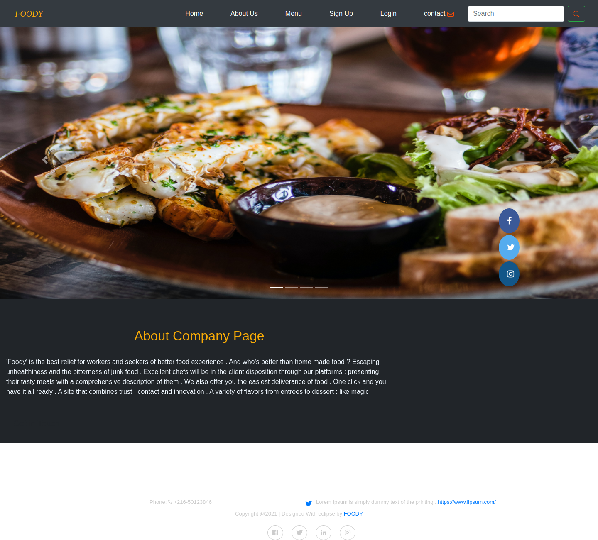
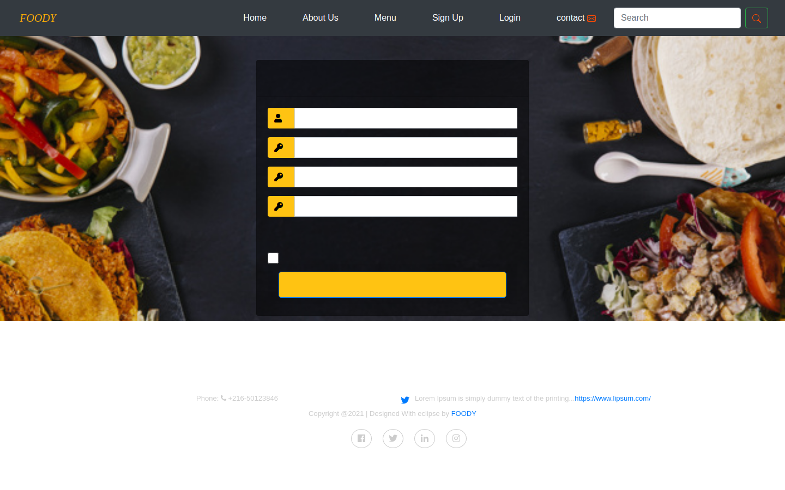
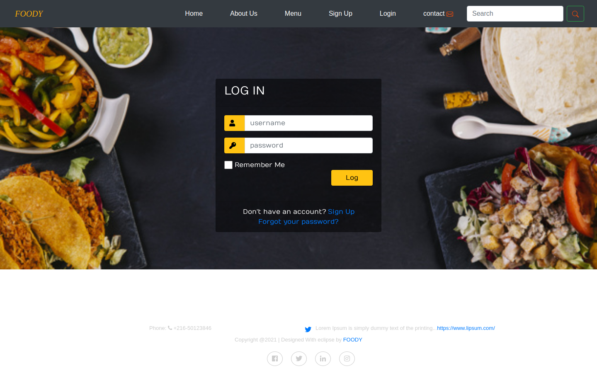

# Foody

Foody is a university group project for browsing restaurant dishes and managing menu data. It combines an Angular frontend with a small FastAPI/MySQL backend.

This is an older project, so I keep it here mainly to show an earlier full-stack project and how my development experience started before my more recent Vue/NestJS work.

## What it does

- Browse dishes by cuisine/category
- Customer sign-up and login
- Admin-style menu management
- Add, update and delete dishes
- Separate categories for Tunisian, Italian, French, Asian food and desserts
- Angular routing and responsive pages
- MySQL persistence through a Python API

## Stack

- Angular 11 / TypeScript
- FastAPI / Python
- MySQL
- Bootstrap and Font Awesome

## Project structure

```text
Foody/
├── FrontEnd/Projet/     # Angular application
├── Backend/MyDB/        # FastAPI application
├── Backend/sql/         # database schemas
├── DataBase/            # database model
├── UI/                  # original wireframes
├── UX/                  # original design source
└── spec/                # original project specification
```

## Screenshots

These screenshots are captured from the Angular application after a real production build in GitHub Actions. They cover the main landing page and the two entry points for user authentication.

### Home



### Sign up



### Login



The screenshot workflow builds the Angular application, validates the backend Python code, serves the generated files in SPA mode, and checks the carousel images and authentication routes before capturing the browser pages. These are runtime captures rather than mock images.

## Run locally

### Backend

Create a virtual environment and install the backend dependencies:

```bash
cd Backend
python -m venv .venv
# Windows: .venv\\Scripts\\activate
# macOS/Linux: source .venv/bin/activate
pip install -r requirements.txt
```

Import `Backend/sql/Webclient.sql` into the `Webclient` database and `Backend/sql/testDB.sql` into MySQL before starting the API.

Configure the database connection with environment variables:

```text
DB_HOST=localhost
DB_PORT=3306
DB_USER=root
DB_PASSWORD=
CORS_ORIGINS=http://localhost:4200
```

Start the API:

```bash
uvicorn MyDB.main:app --reload
```

Health check: `GET /health`

### Frontend

```bash
cd FrontEnd/Projet
npm install
npm start
```

The Angular application runs on `http://localhost:4200`.

## Notes

The original project used direct SQL statements and local database credentials. The backend has since been cleaned up to use typed request models, environment-based database configuration, parameterized SQL for user data, hashed passwords, duplicate-account handling, and a whitelist for category table names.

The repository intentionally keeps the original UI/design and specification material because this was a university group project.

## Project context

Foody was developed as a university group project. It is not intended to represent my current production stack; my current portfolio projects focus on NestJS, Vue.js, React and Azure.
